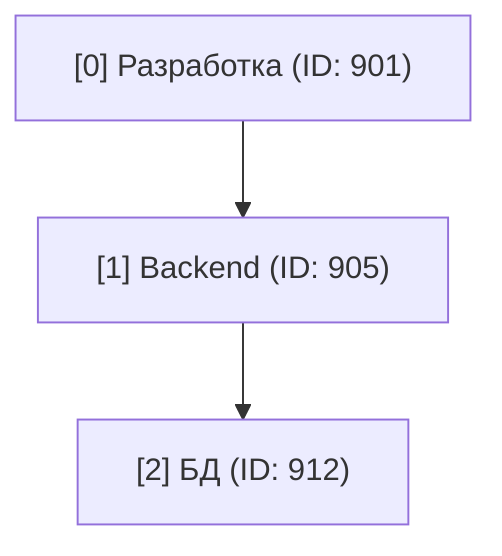

# Документация приложения: Интеграция с Битрикс24

Этот документ объединяет в себе техническую документацию, описание полей (Мастер полей) и алгоритмы работы серверного приложения, интегрированного с Битрикс24. Он предназначен как для пользователей, так и для разработчиков, поддерживающих систему.

## 1. Мастер полей (Data Structure)

Здесь описаны поля, используемые в смарт-процессе "Метки времени" (Smart Process) в Битрикс24, и их соответствие полям внутри данного приложения.

### 1.1. Поля Битрикс24 (`bitrix_fields`)

Смарт-процесс "Метки времени" (`entityTypeId: 1164`) содержит следующие поля:

| ID (API Key)                   | Название (UI)               | Тип данных   | Описание/Назначение |
|--------------------------------|-----------------------------|--------------|---------------------|
| `id`                           | ID                          | integer      | Уникальный идентификатор записи. |
| `ufCrm87_1761919581`           | ID задачи                   | string       | ID задачи в Битрикс24, к которой относится метка. |
| `ufCrm87_1761919601`           | Сотрудник                   | employee     | Пользователь Битрикс24, ответственный за запись. |
| `ufCrm87_1761919617`           | Количество часов            | double       | Время, затраченное на задачу. |
| `ufCrm87_1763717129`           | Учитываем?                  | boolean      | Флаг: учитывается ли это время в зарплате/отчетах. |
| `ufCrm87_1762023633`           | Не учитываемые часы         | double       | Часы, которые не идут в зачет. |
| `ufCrm87_1762026149771`        | Описание                    | string       | Комментарий к метке времени. |
| `ufCrm87_1764191110`           | ID задач (иерархия)         | string       | JSON-массив ID задач от корня до текущей. |
| `ufCrm87_1764191133`           | Title задач (иерархия)      | string       | JSON-массив названий задач от корня до текущей. |
| `UF_CRM_87_1764265626`         | ID проекта                  | string       | Прямая ссылка на ID проекта (группы). |
| `UF_CRM_87_1764265641`         | Название проекта            | string       | Прямое название проекта. |
| `ufCrm87_1764361585`           | Название задачи             | string       | Название задачи из иерархии (последний элемент). |
| `ufCrm87_1764446274`           | Дата отражения              | datetime     | Дата, за которую внесено время. |
| `createdTime`                  | Когда создан                | datetime     | Техническая дата создания записи. |

### 1.2. Поля Приложения (`application_fields`) и Сопоставление

Внутренняя структура данных приложения отображается на поля Битрикс24 следующим образом:

| ID поля Приложения       | ID поля Битрикс24       | Описание типа данных в приложении |
|--------------------------|-------------------------|-----------------------------------|
| `id_elem`                | `id`                    | string (уникальный ключ)          |
| `id_zadachi`             | `ufCrm87_1761919581`    | string                            |
| `sotrudnik`              | `ufCrm87_1761919601`    | string (ID пользователя)          |
| `kolichestvo_chasov`     | `ufCrm87_1761919617`    | double                            |
| `uchitivaem`             | `ufCrm87_1763717129`    | boolean                           |
| `ne_uchitivaemie_chasi`  | `ufCrm87_1762023633`    | double                            |
| `opisanie`               | `ufCrm87_1762026149771` | string                            |
| `id_zadach_ierarhiya`    | `ufCrm87_1764191110`    | JSON string -> Array              |
| `title_zadach_ierarhiya` | `ufCrm87_1764191133`    | JSON string -> Array              |
| `nazvanie_zadachi`       | `ufCrm87_1764361585`    | string (название задачи)          |

---

## 2. Логика работы с данными

### 2.1. Иерархические поля задач

Поля `id_zadach_ierarhiya` и `title_zadach_ierarhiya` критически важны для построения структуры отчетов. Они хранят полный путь от корневой задачи до подзадачи, в которой проставлено время.

1.  **Структура**: Массивы (списки), где индекс элемента соответствует уровню вложенности.
    *   `id_zadach_ierarhiya`: `["Root_ID", "SubTask_ID", "CurrentTask_ID"]`
    *   `title_zadach_ierarhiya`: `["Root_Title", "SubTask_Title", "CurrentTask_Title"]`
2.  **Синхронизация**: Элемент с индексом `i` в массиве названий соответствует элементу с индексом `i` в массиве ID.

**Пример:**
Задача: *Разработка (ID: 901) -> Backend (ID: 905) -> БД (ID: 912)*.
*   `id_zadach_ierarhiya` = `["901", "905", "912"]`
*   `title_zadach_ierarhiya` = `["Разработка", "Backend", "БД"]`

### 2.2. Определение Проекта

Для корректной группировки записей по проектам используется следующий алгоритм приоритетов:

1.  **Основной метод**: Проверяется поле **Название проекта** (`UF_CRM_87_1764265641`). Если оно заполнено, используется это значение.
2.  **Запасной метод**: Если основное поле пустое, берется **первый элемент** (индекс 0) из массива **`title_zadach_ierarhiya`** (корневая задача часто совпадает с проектом или его основной вехой).
3.  **Исключение**: Если оба метода не дали результата, проект помечается как **"Не определён"**.

---

## 3. Общий алгоритм формирования отчётов

### Шаг 0. Получение данных (Fetch)
Используется метод API Битрикс24 `crm.item.list` для сущности `entityTypeId: 1164`.
*   **Фильтры**: Применяются фильтры по дате (`createdTime` или `ufCrm87_1764446274`), сотруднику (`assignedById`) и проекту.
    -   Данные запрашиваются пакетами (batches) по 2500 записей (50 команд по 50 элементов).
    -   Если требуется более 2500 записей, выполняется цикл запросов с паузой (0.2 сек) между пакетами для соблюдения лимитов API.
    -   Фактического жесткого лимита на количество записей нет, он зависит только от таймаута выполнения скрипта.

### Шаг 1. Валидация и нормализация
Каждая "сырая" запись проходит обработку:
1.  **Проверка обязательных полей**: Если `id_zadachi` пуст, запись пропускается.
2.  **Парсинг JSON**: Поля иерархии парсятся из строк в массивы. Ошибка парсинга -> пропуск записи.
3.  **Вычисление полей**:
    *   *Проект*: См. раздел 2.2.
    *   *Название задачи*: Последний элемент массива `title_zadach_ierarhiya`.
    *   *Тип часов*: Если `uchitivaem` == `true`/`1`/`Y`, то "Учитываемые", иначе "Неучитываемые".

### Шаг 2. Агрегация
Нормализованные данные группируются в древовидные структуры в зависимости от типа отчета (см. ниже).

### Шаг 3. Презентация
В интерфейсе отображается итоговое количество обработанных меток (N), попавших в отчет.

---

## 4. Спецификация Отчётов

Приложение генерирует три основных типа отчетов.

### Отчет №1: Метки времени по сотрудникам и проектам

**Цель:** Оценка загрузки сотрудников в разрезе проектов.

**Структура группировки:**
1.  **Сотрудник** (ФИО)
2.  **Проект** (Название)
3.  **Иерархия задач** (Дерево от родителя к потомку)
4.  **Метки времени** (Конечные записи с часами)

**Столбцы таблицы:**
*   Название задачи / Метка
*   ID задачи
*   Количество часов
*   Тип часов (Учитываемые/Неучитываемые)
*   Дата отражения

---

### Отчет №2: Отчет по проектам

**Цель:** Анализ затрат ресурсов на конкретные проекты.

**Структура группировки:**
1.  **Проект**
2.  **Сотрудник**
3.  **Иерархия задач**
4.  **Метки времени**

*Примечание*: Если над одной задачей работали разные сотрудники, они будут разнесены в разные ветки под группировкой Проекта. Столбцы идентичны Отчету №1.

---

### Отчет №3: Ежемесячный табель

**Цель:** Сводка рабочего времени за месяц (календарный вид).

**Структура (Матрица):**
*   **Строки**: Сотрудники.
*   **Столбцы**:
    *   Итоговые: *Сотрудник, Всего, Учтено, Не учтено*.
    *   Календарные: *1, 2, 3... 30/31* (дни месяца).

**Функционал:**
*   В ячейке дня: Сумма часов за этот день.
*   Клик по ячейке: Popup с детализацией (список задач и меток за этот день).
*   Выделение выходных дней.

---

### Отчет №4: Учёт по проектам/задачам

**Цель:** Детальная разбивка трудозатрат по задачам внутри проектов.

**Структура группировки:**
1.  **Проект** (Название)
2.  **Задача** (Иерархия в виде дерева)
3.  **Сотрудник** (ФИО)
4.  **Метки времени** (Записи с часами)

**Столбцы таблицы:**
*   Название задачи / Метка
*   ID задачи
*   Количество часов
*   Тип часов (Учитываемые/Неучитываемые)
*   Дата отражения

**Особенности:**
*   Фильтрация по сотрудникам и проектам
*   Все группы свёрнуты по умолчанию (сворачиваемые узлы)
*   Экспорт в Excel
