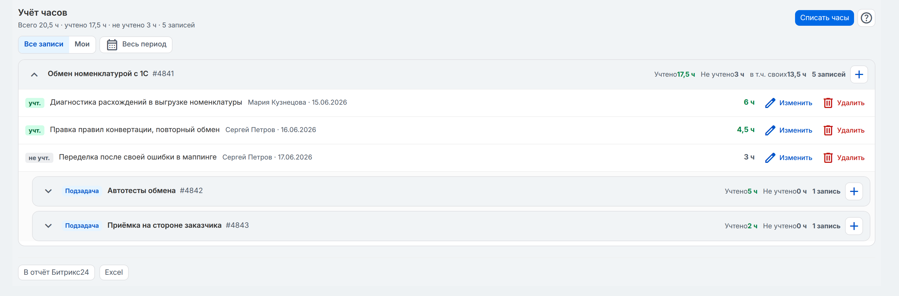
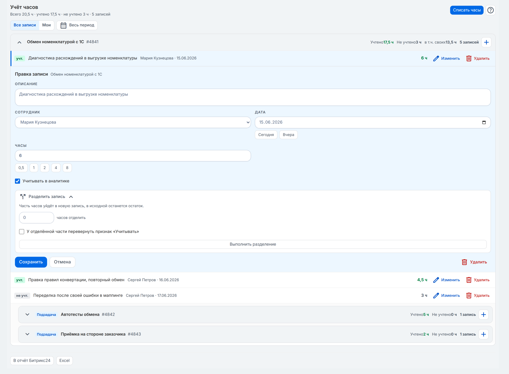
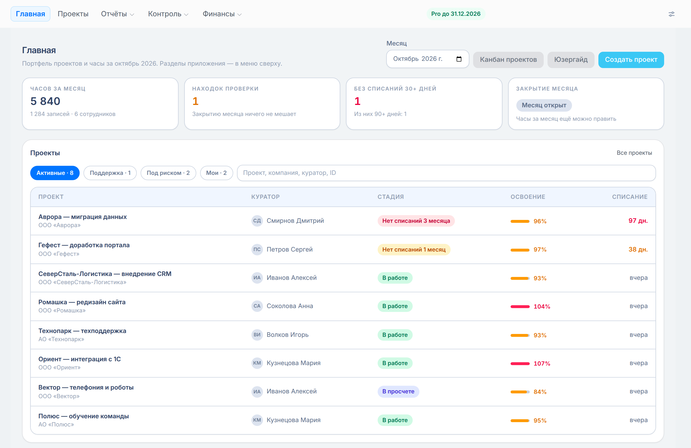
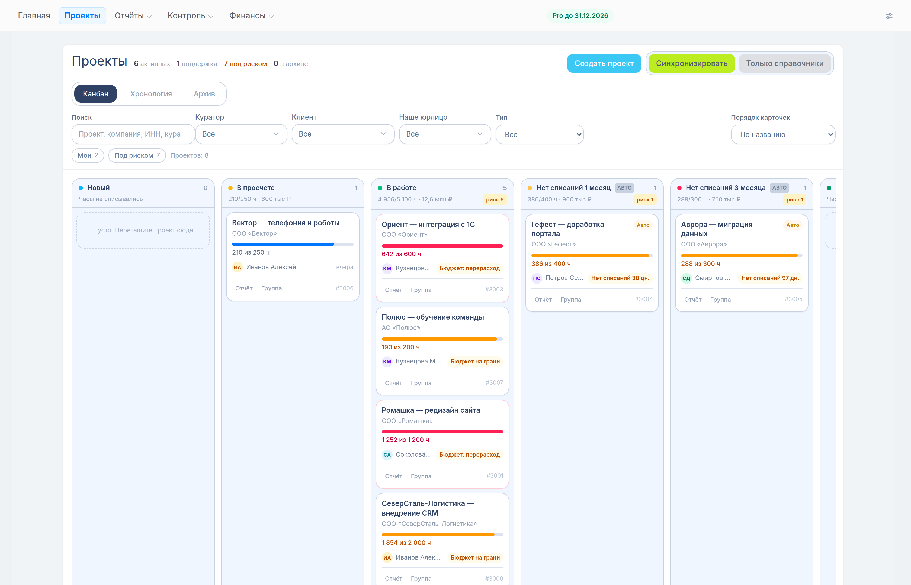
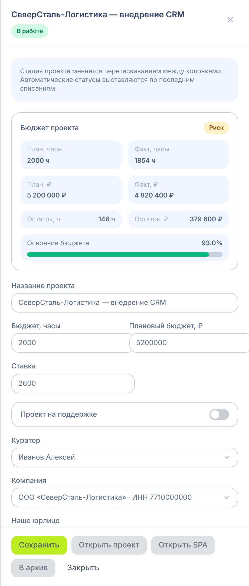
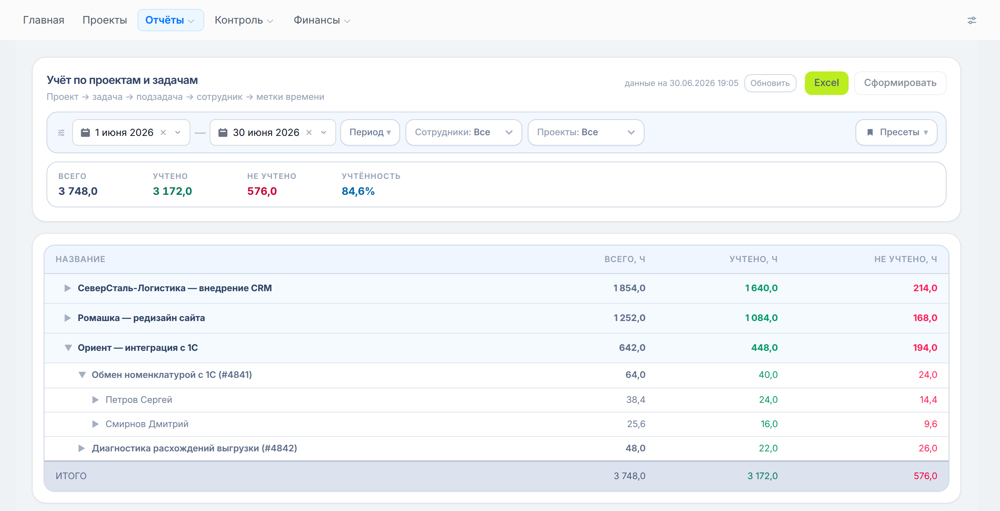
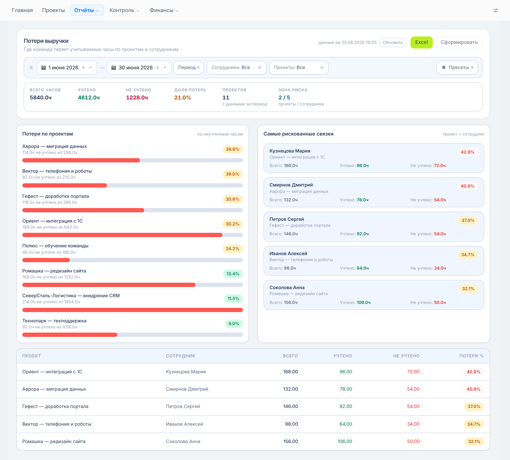
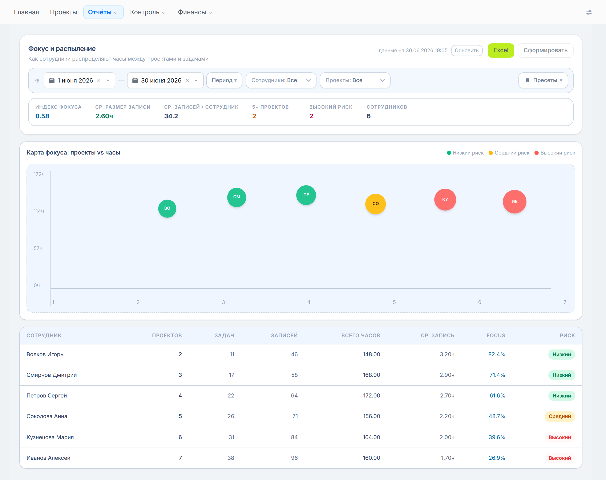
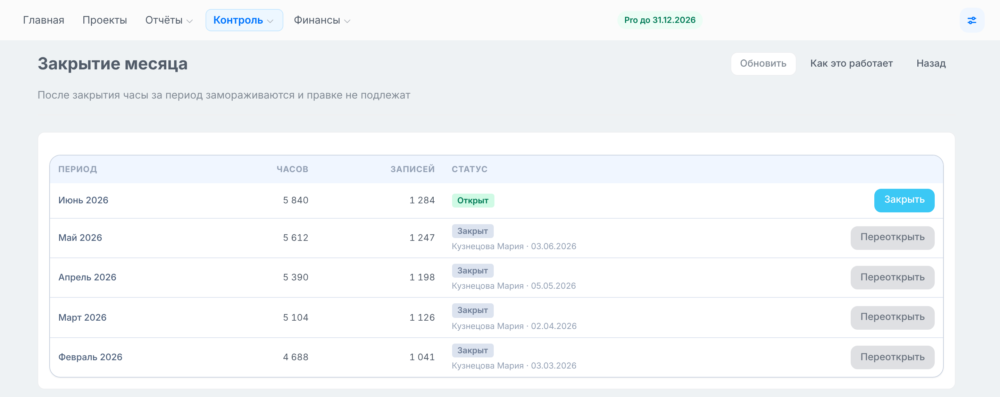
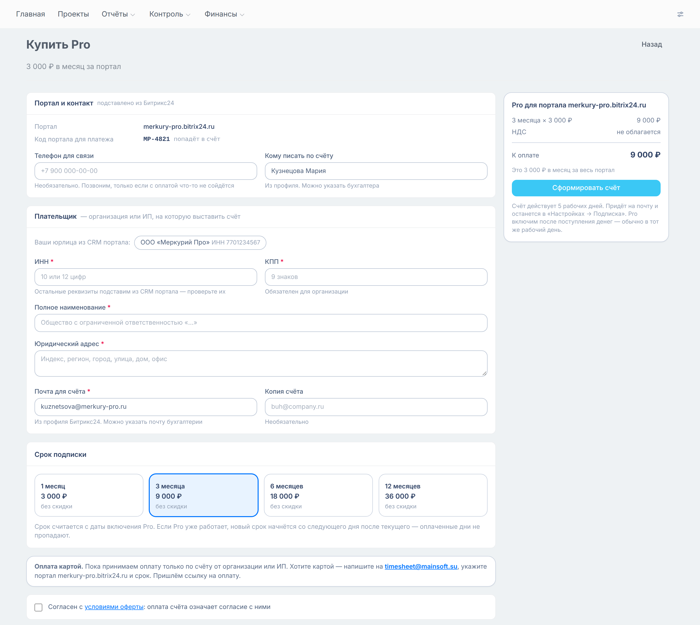

# Скриншоты для Маркета — версия 2.0

Сняты 05.10.2026 с настоящего интерфейса боевой ветки `prod_2026` на демоданных (вымышленная компания «Меркурий Про», июнь 2026). Это не макеты: фронтенд приложения запущен как есть, подменены только портал Битрикс24 и ответы сервера.

Текст карточки, к которому относятся скриншоты, — [`docs/MARKETPLACE_UPDATE_2026-10.md`](../../../docs/MARKETPLACE_UPDATE_2026-10.md).

Все файлы сняты с двойной плотностью пикселей. Если кабинет разработчика ограничит размер, уменьшайте вдвое — картинка останется чёткой.

## 1. Вкладка «Учет времени» в задаче

## 2. Правка и разделение записи

## 3. Главная

## 4. Доска проектов

## 5. Карточка проекта

## 6. Отчёт «Учёт по проектам и задачам»

## 7. Отчёт «Потери выручки»

## 8. Отчёт «Фокус и распыление»

## 9. Закрытие месяца

## 10. Заявка на Pro

## Что учесть

- На главной подпись «за октябрь 2026», а цифры июньские: главная всегда показывает текущий месяц, демоданные заведены за июнь.
- В отчёте «Потери выручки» плитка «Проектов» показывает 11, а в списке восемь проектов — расхождение в демоданных, не в приложении.
- На кадрах 3, 4 и 9 в шапке метка «Pro до 31.12.2026»: они сняты с включённым тарифом. Кадр 10 снят без тарифа.
- В заявке на Pro скидки за длинный срок не показаны: их размер на демостенде не задан.
- Отчёт «Дисциплина внесения времени» не снят: демоданные для него неверны.
